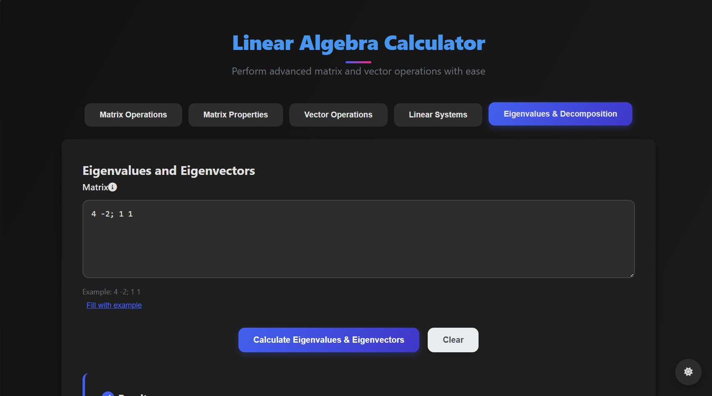
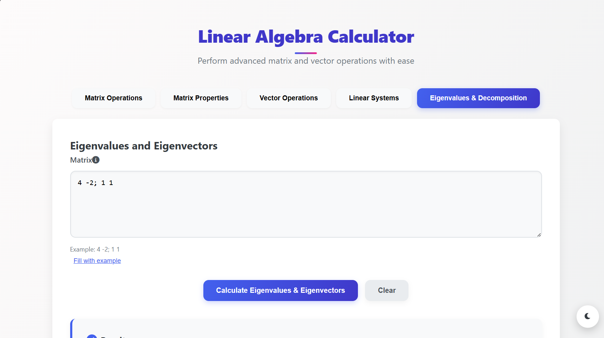
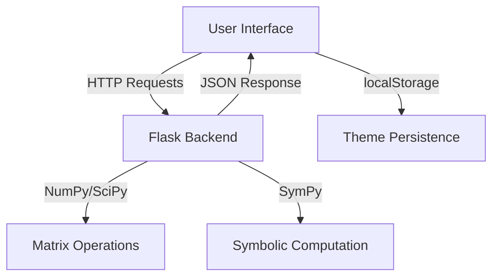

---

# Linear Algebra Calculator Web Application




## Table of Contents
- [Project Overview](#project-overview)
- [Key Features](#key-features)
- [Technology Stack](#technology-stack)
- [Installation Guide](#installation-guide)
- [Usage Instructions](#usage-instructions)
- [System Architecture](#system-architecture)
- [Development Roadmap](#development-roadmap)
- [Contributing](#contributing)
- [License](#license)

## Project Overview

The Linear Algebra Calculator is a comprehensive web application designed to perform complex linear algebra computations through an intuitive interface. This tool serves students, educators, and professionals by providing instant access to essential matrix and vector operations without requiring specialized mathematical software.

## Key Features

### Core Operations
- **Matrix Calculations**:
  - Basic operations (addition, subtraction, multiplication)
  - Advanced operations (determinant, inverse, transpose, rank)
  - Matrix decompositions (LU, QR, SVD, Cholesky)
  
- **Vector Operations**:
  - Dot product and cross product (3D)
  
- **Equation Solving**:
  - Systems of linear equations solver
  - Eigenvalue and eigenvector computation
  - Characteristic polynomial calculation

### User Experience
- Responsive, themeable interface (light/dark modes)
- Multiple input methods (form fields or text input)
- Clean result visualization
- Persistent user preferences (theme selection)

## Technology Stack

| Component       | Technologies Used                          |
|-----------------|--------------------------------------------|
| **Frontend**    | HTML5, CSS3, JavaScript (ES6+)             |
| **Backend**     | Python 3.8+, Flask                         |
| **Math Engine** | NumPy, SciPy, SymPy (for symbolic math)    |
| **UI Features** | CSS Variables, Fetch API, localStorage     |

## Installation Guide

### Prerequisites
- Python 3.8 or later
- pip package manager
- Modern web browser

### Setup Instructions

1. Clone the repository:
   ```bash
   git clone https://github.com/yourusername/linear-algebra-calculator.git
   cd linear-algebra-calculator
   ```

2. Create and activate a virtual environment:
   ```bash
   python -m venv venv
   source venv/bin/activate  # Linux/MacOS
   venv\Scripts\activate    # Windows
   ```

3. Install dependencies:
   ```bash
   pip install -r requirements.txt
   ```

4. Launch the application:
   ```bash
   python app.py
   ```

5. Access the application at:
   ```
   http://localhost:10000
   ```

## Usage Instructions

### Matrix Input Formats
1. **Interactive Grid**:
   - Select matrix dimensions
   - Fill values directly in the input cells

2. **Text Input**:
   ```
   1 2 3; 4 5 6; 7 8 9  # Represents a 3×3 matrix
   ```

### Performing Operations
1. Enter your matrices/vectors
2. Select the desired operation
3. View results in the output panel
4. Use the theme toggle to switch between light/dark modes

## System Architecture



## Development link

https://shreeyakollipara.pythonanywhere.com/

### Planned Enhancements
- [ ] Matrix visualization tools
- [ ] Step-by-step solution explanations
- [ ] Export capabilities (LaTeX, CSV, PNG)
- [ ] User authentication for saving calculations
- [ ] Mobile application version

### Known Issues
- Symbolic computation can be slow for large matrices
- Limited complex number support

---
